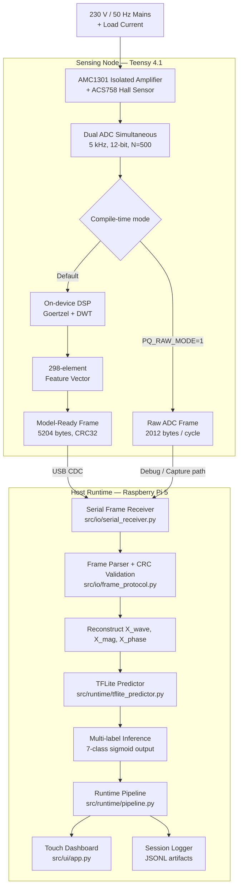
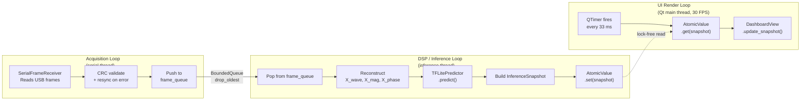
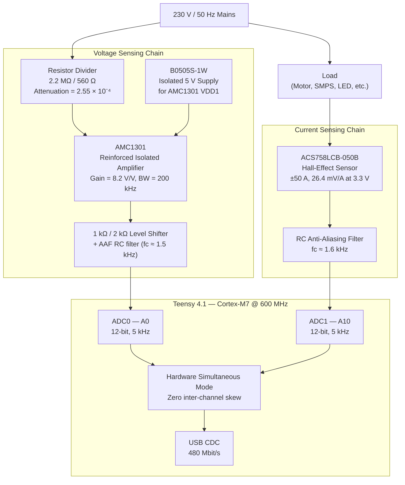
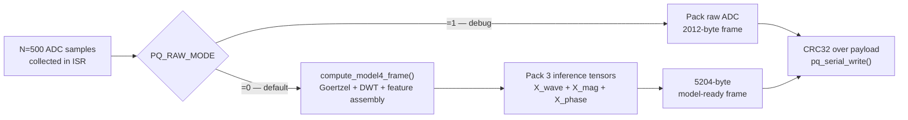
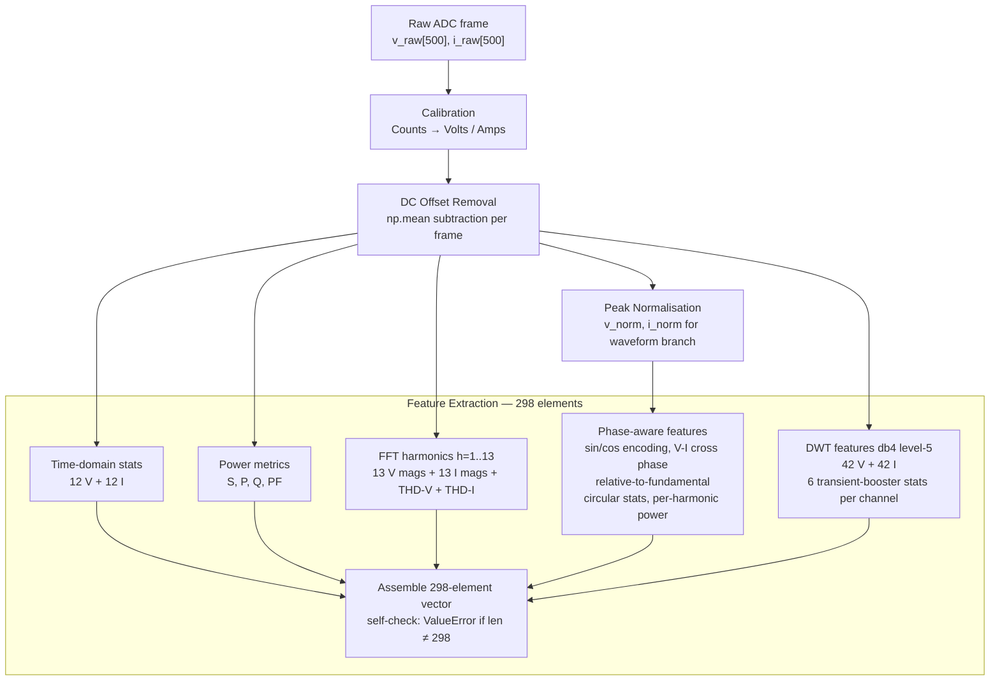
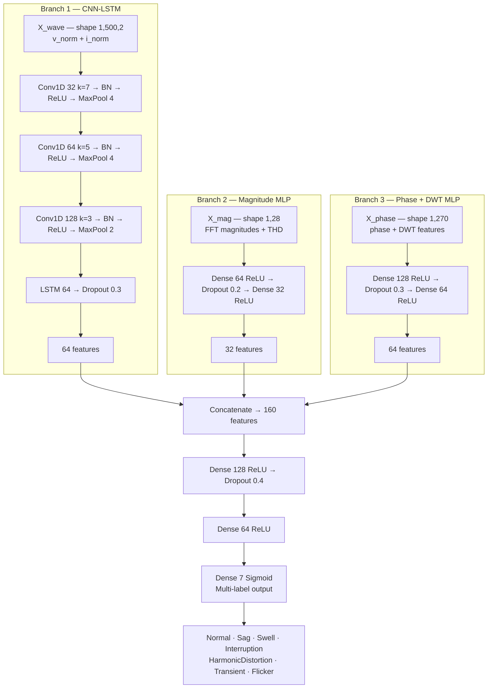

# Phase-Aware Real-Time Power Quality Monitoring System

A complete, hardware-enabled, end-to-end system for real-time detection and classification of power quality disturbances in low-voltage 230 V / 50 Hz networks. The system acquires synchronized dual-channel waveforms from a Teensy 4.1 microcontroller, extracts a 298-element phase-aware feature vector on-device, streams model-ready inference frames over USB to a Raspberry Pi 5, and renders a live touch dashboard with harmonic spectra, disturbance probabilities, event log, and system health telemetry.

The project's core scientific contribution is demonstrating that **harmonic phase angles carry load-type-specific signatures** that are statistically distinct even when harmonic magnitudes are nearly identical — and that a deep learning model trained on phase-aware features outperforms magnitude-only baselines by 1–3% overall and substantially more for hard-to-distinguish class pairs.

---

## Table of Contents

1. [System Architecture](#1-system-architecture)
2. [Why Phase Information Matters](#2-why-phase-information-matters)
3. [Hardware Design](#3-hardware-design)
4. [Firmware](#4-firmware)
5. [Signal Processing and Feature Extraction](#5-signal-processing-and-feature-extraction)
6. [Deep Learning Model](#6-deep-learning-model)
7. [Dataset](#7-dataset)
8. [Repository Structure](#8-repository-structure)
9. [Setup](#9-setup)
10. [Running](#10-running)
11. [Firmware Targets](#11-firmware-targets)
12. [Testing](#12-testing)
13. [Kiosk Deployment](#13-kiosk-deployment)
14. [Hardware Validation](#14-hardware-validation)
15. [Configuration Reference](#15-configuration-reference)
16. [Performance Targets](#16-performance-targets)
17. [Safety](#17-safety)

---

## 1. System Architecture

### 1.1 End-to-End Pipeline



### 1.2 Three-Loop Runtime Architecture

The host runtime is decomposed into three independent loops communicating through bounded thread-safe queues. No loop blocks another.



**Backpressure policy:** `BoundedQueue` with `drop_oldest` — when the DSP loop falls behind, the oldest unprocessed frame is discarded rather than blocking the acquisition loop or stalling the UI.

### 1.3 Signal Acquisition Contract

| Parameter              | Value                                                        |
|------------------------|--------------------------------------------------------------|
| Sampling rate          | 5000 Hz                                                      |
| Samples per frame      | 500 (exactly 1 mains cycle at 50 Hz)                        |
| Frame trigger          | Rising zero-crossing on voltage channel                      |
| ADC resolution         | 12-bit (4096 levels, 0.806 mV/count)                        |
| Voltage channel        | A0 → ADC0 (Teensy hardware simultaneous)                    |
| Current channel        | A10 → ADC1 (Teensy hardware simultaneous)                   |
| Harmonic orders        | h = 1 through 13 (50 Hz to 650 Hz)                          |
| Spectral resolution    | Δf = 10 Hz/bin — all harmonics on exact integer bins         |
| Raw frame size         | 2012 bytes                                                   |
| Model-ready frame size | 5204 bytes                                                   |
| Frame magic            | `0xDEADBEEF` (4 bytes, big-endian)                          |
| CRC                    | CRC32 little-endian, compatible with Python `binascii.crc32` |

---

## 2. Why Phase Information Matters

### 2.1 The Limitation of Magnitude-Only Monitoring

Conventional power quality analysers (Hioki PQ3198, Fluke 435-II, Dranetz HDPQ) measure harmonic **magnitudes** and THD with high accuracy but discard harmonic **phase angles** entirely. This is a meaningful loss of information.

The phase structure of a harmonic spectrum is physically determined by the energy conversion mechanism in the load — not random noise:

| Load Type | Dominant Harmonic | Phase Signature |
|---|---|---|
| SMPS / Bridge Rectifier | 3rd | φ₃ ≈ +45° — capacitor charge pulse near voltage peak |
| 6-Pulse VFD Rectifier | 5th, 7th | φ₅ ≈ −72°, φ₇ ≈ +51° — locked to firing angle α |
| Saturating Transformer | 3rd | φ₃ ≈ +90° — saturation at flux peak (voltage zero-crossing) |
| LED Driver (no PFC) | 3rd | φ₃ distinct from SMPS; THD may be identical |

Two different loads can produce **identical THD and identical harmonic magnitudes but entirely different phase structures**. A magnitude-only classifier cannot distinguish them. A phase-aware classifier can.

### 2.2 Spectral Leakage and Why N = 500

For accurate phase extraction, each harmonic must fall exactly on an FFT bin. With sampling rate f_s = 5000 Hz:

| FFT size | Bin spacing Δf | Fundamental bin | Result |
|---|---|---|---|
| N = 512 (power of 2) | 9.766 Hz | bin 5.12 — **non-integer** | Energy leaks across 3–5 bins. Phase error 10–30°. |
| **N = 500 (this project)** | **10.00 Hz** | **bin 5 — integer** | **Zero spectral leakage. Phase extracted cleanly.** |

This single design choice — 500 samples at 5 kHz — eliminates spectral leakage for all harmonics up to the 13th (bin 65), making accurate phase extraction possible with a simple rFFT.

---

## 3. Hardware Design

### 3.1 Architecture



### 3.2 Voltage Sensing — AMC1301

The AMC1301 is a Texas Instruments precision **reinforced isolated amplifier** using capacitively-coupled sigma-delta modulation. It physically separates the mains-referenced measurement circuit from the MCU ground.

| Parameter | Value |
|---|---|
| Input range | ±250 mV differential |
| Fixed gain | 8.2 V/V |
| Isolation voltage | 7070 V_PEAK (reinforced, IEC 60747-17) |
| Working voltage | 1000 V_RMS continuous |
| Bandwidth | ~200 kHz |
| Gain error (max, 25°C) | ±0.3% |
| Nonlinearity | 0.03% max |

**Voltage divider** scales 230 V mains (±325 V peak) to within the AMC1301 ±250 mV input range:

```
R1 = 2.2 MΩ (two 1.1 MΩ in series — single-fault-tolerant)
R2 = 560 Ω

Divider ratio = 560 / 2,200,560 = 2.545 × 10⁻⁴

At 270 V RMS (worst-case swell, ±382 V peak):
  V_INP = 382 × 2.545e-4 = 97.2 mV   →   39% of ±250 mV limit  ✓
```

**Output stage:** OUTN tied to REFIN sets midpoint at VDD2/2 = 2.5 V. A 1 kΩ/2 kΩ divider scales OUTP to the 0–3.3 V Teensy ADC range. A 390 Ω + 100 nF RC forms the anti-aliasing filter (f_c ≈ 1.5 kHz).

**Critical isolation rule:** GND1 (mains neutral reference) and GND2 (Teensy GND) are **never connected**. The B0505S-1W isolated DC-DC module powers VDD1 from the Teensy VUSB rail without bridging the isolation barrier.

### 3.3 Current Sensing — ACS758LCB-050B

The ACS758 is an Allegro Hall-effect current sensor with galvanic isolation between the current-carrying conductor and the signal output.

| Parameter | Value |
|---|---|
| Current range | ±50 A bidirectional |
| Sensitivity (at 3.3 V) | 26.4 mV/A (ratiometric) |
| Quiescent output | VCC/2 = 1.65 V |
| Bandwidth | 120 kHz |
| Isolation (load to signal) | 4800 V_RMS |

Powered from the Teensy 3.3 V rail, the output is guaranteed within 0–3.3 V for any input current up to ±50 A. At a typical 10 A RMS demo load the peak-to-peak swing is ~0.53 V (656 ADC counts), giving 30.5 mA/count resolution — sufficient to resolve harmonics at 5% of fundamental.

### 3.4 Bill of Materials (Sensing Frontend)

| Component | Part Number | Qty | Unit Cost (est.) |
|---|---|---|---|
| Isolated amplifier | AMC1301DWVR | 1 | ₹150 |
| Isolated DC-DC | B0505S-1W SIP-7 | 1 | ₹80 |
| Hall-effect sensor | ACS758LCB-050B | 1 | ₹320 |
| High-voltage resistors | 1.1 MΩ 1/4W 1% | 2 | ₹20 |
| Low-side resistor | 560 Ω 1/4W 1% | 1 | ₹5 |
| Level-shift resistors | 1 kΩ, 2 kΩ, 390 Ω | 3 | ₹6 |
| Capacitors | 100 nF NP0, 10 µF | 4 | ₹20 |
| PCB / misc | — | — | ₹190 |
| **Total** | | | **≈ ₹791** |

---

## 4. Firmware

### 4.1 Overview

The Teensy 4.1 firmware runs a 5 kHz IntervalTimer ISR that simultaneously triggers both ADC channels using hardware synchronised mode — zero inter-channel skew between voltage and current samples. Window capture is aligned to the **rising zero-crossing** of the voltage waveform, ensuring the fundamental phase angle φ₁ is consistently near 0 radians and all harmonic phase angles are physically meaningful between windows.

### 4.2 Acquisition ISR

```cpp
// Timer period = 200 µs (1e6 / 5000 Hz)
// A0 → ADC0 (voltage), A10 → ADC1 (current)
// Hardware simultaneous mode — both channels convert in parallel

void FASTRUN sampleISR() {
    ADC::Sync_result r = adc->readSynchronizedSingle(A0, A10);
    int16_t v     = (int16_t)r.result_adc0;
    int16_t i_val = (int16_t)r.result_adc1;

    bool risingZC = (prevV < (ADC_MIDPOINT - ZC_HYSTERESIS)) &&
                    (v    >= (ADC_MIDPOINT + ZC_HYSTERESIS));

    if (!collecting && !windowReady && risingZC) { collecting = true; sampleCount = 0; }

    if (collecting) {
        v_buf[sampleCount] = v;
        i_buf[sampleCount] = i_val;
        if (++sampleCount >= N) { collecting = false; windowReady = true; }
    }
    prevV = v;
}
```

### 4.3 Frame Protocol

Two transport modes are available as compile-time flags:



**Model-ready frame layout (production, 5204 bytes):**

```
[magic 4B BE][seq 2B LE][type 2B LE = 0x0003]
[X_wave  4000B]   — v_norm[500 f32] + i_norm[500 f32]
[X_mag    112B]   — feat[28:56]      (28 f32)
[X_phase 1080B]   — feat[0:28] + feat[56:214] + feat[214:298]  (270 f32)
[crc32    4B LE]
```

**Raw ADC frame layout (debug/capture, 2012 bytes):**

```
[magic 4B BE][seq 2B LE][n=500 2B LE]
[v_raw 1000B]   — 500 int16 samples
[i_raw 1000B]   — 500 int16 samples
[crc32  4B LE]
```

### 4.4 Build Flags

| Flag | Effect |
|---|---|
| `PQ_RAW_MODE=1` | Emit 2012-byte raw ADC frame (training data capture, HIL validation) |
| `PQ_DEBUG_TIMING=1` | Print per-frame DSP and total latency over Serial |
| `PQ_FREE_RUN_FALLBACK=1` | Free-run sampling if zero-crossing times out after 250 samples |

---

## 5. Signal Processing and Feature Extraction

### 5.1 Processing Pipeline



### 5.2 Feature Vector Layout (298 Elements)

| Slice | Block | Description | Count |
|---|---|---|---|
| `[0:12]` | `time_v` | mean, std, rms, peak, crest factor, form factor, skewness, kurtosis, peak-to-peak, zero crossings, min, max — voltage | 12 |
| `[12:24]` | `time_i` | Same 12 statistics for current | 12 |
| `[24:28]` | `power_metrics` | Apparent power (VA), active power (W), reactive power (VAR), power factor | 4 |
| `[28:41]` | `mag_v` | FFT magnitudes for V harmonics h=1..13 | 13 |
| `[41:54]` | `mag_i` | FFT magnitudes for I harmonics h=1..13 | 13 |
| `[54:56]` | `thd` | THD-V, THD-I | 2 |
| `[56:82]` | `phase_self_v` | sin(φ_vh), cos(φ_vh) for h=1..13 | 26 |
| `[82:108]` | `phase_self_i` | sin(φ_ih), cos(φ_ih) for h=1..13 | 26 |
| `[108:134]` | `phase_cross` | sin(φ_vh − φ_ih), cos(φ_vh − φ_ih) for h=1..13 | 26 |
| `[134:158]` | `phase_rel_v` | sin/cos of V phases relative to fundamental, h=2..13 | 24 |
| `[158:182]` | `phase_rel_i` | sin/cos of I phases relative to fundamental, h=2..13 | 24 |
| `[182:195]` | `power_harm_active` | Active power per harmonic, h=1..13 | 13 |
| `[195:208]` | `power_harm_reactive` | Reactive power per harmonic, h=1..13 | 13 |
| `[208:214]` | `circ_stats` | Circular mean/std of V phases, I phases, cross phases | 6 |
| `[214:256]` | `dwt_v` | 36 standard + 6 transient-booster DWT statistics, voltage | 42 |
| `[256:298]` | `dwt_i` | 36 standard + 6 transient-booster DWT statistics, current | 42 |
| | **Total** | | **298** |

**Inference tensor split:**

```
X_wave  = v_norm[500] + i_norm[500]          →  shape (1, 500, 2)   waveform branch
X_mag   = feat[28:56]                         →  shape (1, 28)       magnitude branch
X_phase = feat[0:28] + feat[56:298]           →  shape (1, 270)      phase+DWT branch
```

### 5.3 Wavelet Subband Map (db4, 5-level, 5 kHz input)

| Subband | Frequency Range | Physical Content |
|---|---|---|
| A5 | 0 – 78 Hz | Fundamental + sub-harmonics |
| D5 | 78 – 156 Hz | 2nd–3rd harmonic region |
| D4 | 156 – 312 Hz | 3rd–6th harmonic region |
| D3 | 312 – 625 Hz | 6th–12th harmonic region |
| D2 | 625 – 1250 Hz | Upper harmonics + HF switching noise |
| D1 | 1250 – 2500 Hz | Noise + aliased switching components |

Per subband statistics: mean, std, energy, max absolute value, skewness, kurtosis (6 metrics × 6 subbands = 36 per channel). Plus 6 transient-booster statistics per channel: D1/D2 energy ratios, D1/D2 max amplitudes, and TKEO (Teager-Kaiser Energy Operator) summaries — sensitive to impulsive transients that are invisible to FFT averaging.

> **Note on circular statistics:** Phase angles are periodic and wrap at ±π. `np.mean()` on phase angles is undefined on a circle — the arithmetic mean of [+175°, −175°] returns 0° when the true circular mean is ±180°. All circular summaries use `scipy.stats.circmean` and `scipy.stats.circstd` with `high=np.pi, low=-np.pi`.

---

## 6. Deep Learning Model

### 6.1 Architecture

The production model is a **phase-aware hybrid CNN–LSTM + MLP** with three parallel branches that process waveform, magnitude, and phase information independently before fusion.



**Total parameters:** ~280,000. Trainable on CPU in under 1 hour for 38,500 samples.

### 6.2 Model Variants and Ablation Study

Four variants were defined for a structured ablation that directly measures the accuracy contribution of each information type:

| Variant | Waveform Branch | Magnitude Branch | Phase+DWT Branch | Purpose |
|---|---|---|---|---|
| M1 — Baseline MLP | — | ✓ | — | Magnitude-only lower bound |
| M2 — Raw Waveform | ✓ | — | — | Waveform-only signal quality |
| M3 — CNN-LSTM + Mag | ✓ | ✓ | — | Phase-free upper bound |
| **M4 — Full (production)** | ✓ | ✓ | ✓ | **Phase contribution measurement** |

The comparison **M3 → M4** directly quantifies how much harmonic phase information improves classification accuracy. The comparison **V-only → V+I** measures the value of simultaneous current measurement.

### 6.3 Classes and Detection Thresholds

| ID | Class | Default Threshold |
|---|---|---|
| 0 | Normal | 0.50 |
| 1 | Sag | 0.50 |
| 2 | Swell | 0.35 |
| 3 | Interruption | 0.50 |
| 4 | HarmonicDistortion | 0.50 |
| 5 | Transient | 0.35 |
| 6 | Flicker | 0.50 |

Per-class thresholds are configurable in `configs/default.yaml` under `ml_inference.thresholds`. Swell and Transient use lower thresholds (0.35) to improve recall for these less-common but physically important events.

### 6.4 Production Artifact

| Property | Value |
|---|---|
| Format | TFLite (`.tflite`) |
| Path | `artifacts/models/pqm_multilabel_model.tflite` |
| Output semantics | Multi-label, independent sigmoid per class |
| Inference runtime | Auto-detected: `tflite_runtime` → `ai-edge-litert` → `tensorflow.lite` |

---

## 7. Dataset

### 7.1 Synthetic Dataset Summary

| Property | Value |
|---|---|
| Total samples | 38,500 |
| Samples per class | 5,500 (balanced) |
| Classes | 7 |
| Sampling assumptions | f_s = 5000 Hz, N = 500, 50 Hz fundamental |
| Feature contract | 298-element vector, fixed random seed |

### 7.2 Signal Generation Parameters

Each class uses physically motivated parametric models:

| Class | Key Parameters |
|---|---|
| Normal | V₁ ~ U(200, 245) V peak; background THD 1–4%; AWGN σ ∈ [0.2%, 1%] × V₁ |
| Sag | Depth d ~ U(0.1, 0.9); duration 0.5–30 cycles; random onset |
| Swell | Depth d ~ Beta(1.5, 5.0) — biased toward small swells 5–25%; duration 0.5–30 cycles |
| Interruption | Residual voltage 0–10% of V₁; duration 1–5 cycles |
| Transient | Amplitude 0.1–1.5 × V₁; decay τ 0.1–2 ms; oscillation f_t 500–2000 Hz |
| Flicker | Amplitude modulation at 1–25 Hz; depth 5–30% |

### 7.3 Harmonic Distortion — Load-Specific Phase Distributions

The HarmonicDistortion class uses **three load subtypes with Von Mises phase distributions** (the circular analogue of Gaussian) to ensure phase features carry genuinely discriminative information:

| Subtype | Load | Phase Signature |
|---|---|---|
| A | SMPS / Bridge Rectifier | φ₃ ~ Von Mises(μ=+45°, κ=3.0) — capacitor charge pulse near voltage peak |
| B | 6-Pulse VFD Rectifier | φ₅ ~ Von Mises(μ=−72°, κ=4.0) — locked to rectifier firing angle |
| C | Saturating Transformer | φ₃ ~ Von Mises(μ=+90°, κ=3.5) — saturation at flux peak (voltage zero-crossing) |

Subtypes A and C both produce strong 3rd harmonics — they are nearly indistinguishable by magnitude alone but are separated by 45° in phase angle. This makes them the most demanding test of the phase-aware classifier.

---

## 8. Repository Structure

```
firmware/
  teensy/pq_firmware/          Active MCU — Teensy 4.1 (PlatformIO)
    src/
      main.cpp                 ISR, zero-crossing, frame packing
      dsp.cpp / dsp.h          On-device feature extraction (Goertzel + DWT)
      goertzel.h               Harmonic magnitude and phase extraction
      dwt.h                    5-level db4 DWT with transient-booster stats
  esp32p4/pq_firmware/         ESP32-P4 firmware port — same frame protocol (set aside)

src/
  io/
    frame_protocol.py          Frame parser, CRC validation, FeatureFrame / ModelReadyFrame
    serial_receiver.py         Serial port open/read/reconnect, magic-byte resync
  dsp/
    preprocess.py              Calibration, DC removal, normalisation
    features.py                Full 298-element feature extractor
    wavelet_features.py        db4 DWT with transient-booster statistics
    feature_index.py           Canonical index constants (TOTAL_FEATURES = 298)
  runtime/
    pipeline.py                3-loop RuntimePipeline, SessionLogger, InferenceSnapshot
    buffers.py                 BoundedQueue, AtomicValue (thread-safe primitives)
    metrics.py                 RuntimeMetrics — latency, drop counts, CRC counters
    tflite_predictor.py        TFLitePredictor — auto-detects runtime backend
  infer/
    live_infer.py              CLI live inference entrypoint
    offline_replay.py          Replay from .bin or .jsonl session logs
  ui/
    app.py                     Main Qt application, argument parser, MainWindow
    views/dashboard.py         Live waveform, harmonic spectrum, probabilities, metrics
    views/events.py            Event timeline panel
    widgets/plots.py           pyqtgraph waveform and spectrum widgets
  system/
    kiosk_setup.sh             Installs and enables pq-monitor.service
    service/pq-monitor.service systemd unit — auto-start and restart-on-failure
    service/pq-monitor.logrotate  Log rotation policy

configs/
  default.yaml                 All runtime parameters

artifacts/
  models/
    pqm_multilabel_model.tflite   Production inference artifact
    pqm_multilabel_model.keras    Training checkpoint
  live_sessions/               Per-session JSONL inference logs
  perf/                        Runtime profile and soak test reports

tests/                         63 unit and integration tests
scripts/                       HIL comparison, timing capture, demo helpers
docs/                          Pi deployment runbook, assembly guide, alignment matrix
assets/ui_theme/               Qt stylesheet (style.qss)
legacy/                        Archived single-signal model experiments (reference only)
release/
  version_manifest.json        Implemented components and validation results
  submission_checklist.md      Final handoff checklist
```

---

## 9. Setup

```bash
# Clone the repository
git clone <repo-url>
cd Real-Time-Power-Quality-Monitoring

# Create and activate virtual environment
python3 -m venv .venv
. .venv/bin/activate

# Install dependencies (Python >= 3.10 required)
pip install -r requirements.txt

# Verify all imports resolve correctly
.venv/bin/python scripts/smoke_test.py
```

**Dependencies:** numpy, scipy, pywavelets, scikit-learn, pyserial, tensorflow, matplotlib, seaborn, joblib, pyyaml, pyside6, pyqtgraph, psutil, pytest.

---

## 10. Running

### Live Inference — Production Mode

Requires a connected Teensy 4.1 running the default (model-ready) firmware:

```bash
.venv/bin/python -m src.ui.app \
  --port /dev/ttyACM0 \
  --config configs/default.yaml \
  --receiver-mode tflite \
  --model artifacts/models/pqm_multilabel_model.tflite
```

### Offline Replay — No Hardware Required

Replay a captured binary session or JSONL session log:

```bash
.venv/bin/python -m src.infer.offline_replay \
  --input artifacts/protocol_test_frames.bin \
  --config configs/default.yaml
```

### CLI Live Inference — Headless

```bash
.venv/bin/python -m src.infer.live_infer \
  --port /dev/ttyACM0 \
  --receiver-mode tflite \
  --max-frames 200
```

### Receiver Modes

| Mode | Frame type consumed | Use case |
|---|---|---|
| `tflite` | 5204-byte model-ready frame | **Production — default** |
| `raw` | 2012-byte raw ADC frame | Training data capture, HIL parity testing |
| `feature` | 1140-byte legacy 282-feature frame | Backward compatibility only |

---

## 11. Firmware Targets

### Teensy 4.1 (Active)

```bash
# Compile
./scripts/compile_teensy_firmware.sh

# Flash
./scripts/flash_teensy_firmware.sh /dev/ttyACM0

# Raw ADC mode (for training data capture and HIL parity validation)
PQ_RAW_MODE=1 pio run -d firmware/teensy/pq_firmware -e teensy41_raw \
  -t upload --upload-port /dev/ttyACM0

# Debug timing build
PQ_DEBUG_TIMING=1 pio run -d firmware/teensy/pq_firmware \
  -t upload --upload-port /dev/ttyACM0
```

### ESP32-P4 (Set Aside)

The ESP32-P4 port is fully implemented and emits the same 5204-byte model-ready frame format. It can replace the Teensy node without any host-side changes.

```bash
./scripts/compile_esp32p4_firmware.sh
./scripts/flash_esp32p4_firmware.sh /dev/ttyACM0
```

---

## 12. Testing

```bash
PYTEST_DISABLE_PLUGIN_AUTOLOAD=1 .venv/bin/python -m pytest -q
```

**63 tests** across:

| Test module | Coverage |
|---|---|
| `test_frame_protocol.py` | Pack/unpack, CRC, magic, frame sizes |
| `test_feature_frame_protocol.py` | FeatureFrame and ModelReadyFrame round-trips |
| `test_feature_shape.py` | Feature vector length == 298 for random valid frames |
| `test_preprocess.py` | Calibration, DC removal, normalisation |
| `test_receiver_resync.py` | Magic-byte resync after corrupt bytes injected |
| `test_runtime_buffers.py` | BoundedQueue drop policy, AtomicValue thread safety |
| `test_runtime_metrics.py` | Latency and counter accumulation |
| `test_tflite_predictor.py` | TFLitePredictor shape contract and inference |
| `test_e2e_pipeline.py` | End-to-end replay from binary frames to snapshot |
| `test_kiosk_startup.py` | kiosk_setup.sh syntax, service file fields |
| `test_esp32p4_protocol_contract.py` | ESP32-P4 frame byte-level contract |
| `test_teensy_dsp_parity.py` | Firmware vs Python feature parity checks |

---

## 13. Kiosk Deployment

Copy the repository to `/opt/pq-monitor` on the target Raspberry Pi 5, then run the installer:

```bash
cd /opt/pq-monitor
sudo ./src/system/kiosk_setup.sh \
  --repo /opt/pq-monitor \
  --user pi \
  --port /dev/ttyACM0 \
  --config configs/default.yaml \
  --receiver-mode tflite \
  --model artifacts/models/pqm_multilabel_model.tflite
```

The installer installs and enables `pq-monitor.service`. On the next boot the device starts the dashboard fullscreen in kiosk mode and auto-restarts on crash or serial disconnect.

**Service management:**

```bash
sudo systemctl status pq-monitor.service --no-pager -n 50
journalctl -u pq-monitor.service -n 100 --no-pager
sudo logrotate -d /etc/logrotate.d/pq-monitor
```

Full deployment steps, pre-flight checklist, and thermal validation are in [docs/pi_deployment_runbook.md](docs/pi_deployment_runbook.md).

**Hardware requirements for deployment:**
- Raspberry Pi 5 (8 GB)
- Official Raspberry Pi touch display
- Active cooling (required for sustained thermal performance)
- Stable 5 V PSU rated for Pi 5 peak load
- Teensy 4.1 sensing node connected via USB

---

## 14. Hardware Validation

Capture host-vs-firmware feature parity (requires connected Teensy):

```bash
.venv/bin/python scripts/hil_compare_raw_feature.py \
  --port /dev/ttyACM0 \
  --frames 50 \
  --pairing anchor \
  --skip-prompts
```

Capture per-frame DSP and total latency from a `PQ_DEBUG_TIMING` build:

```bash
.venv/bin/python scripts/capture_teensy_timing.py \
  --port /dev/ttyACM0 \
  --seconds 30
```

Probe live ESP32-P4 raw frames:

```bash
.venv/bin/python scripts/probe_esp32p4_raw.py --port /dev/ttyACM0
```

---

## 15. Configuration Reference

All runtime parameters are in `configs/default.yaml`:

```yaml
signal:
  fs_hz: 5000
  samples_per_frame: 500
  mains_frequency_hz: 50
  harmonic_orders: [1, 2, 3, 4, 5, 6, 7, 8, 9, 10, 11, 12, 13]

calibration:
  v_adc_midpoint: 1985
  i_adc_midpoint: 2048
  v_counts_to_volts: 0.25745427626960726
  i_counts_to_amps: 0.030518

features:
  expected_feature_length: 298
  dwt_wavelet: db4
  dwt_level: 5

ml_inference:
  model_path: artifacts/models/pqm_multilabel_model.tflite
  receiver_mode: tflite
  output_semantics: multi_label
  thresholds:
    Normal: 0.50
    Sag: 0.50
    Swell: 0.35
    Interruption: 0.50
    HarmonicDistortion: 0.50
    Transient: 0.35
    Flicker: 0.50

runtime:
  max_queue_size: 64
  ui_target_fps: 30
  inference_target_hz: 10
  drop_policy: drop_oldest
```

---

## 16. Performance Targets

| Metric | Target |
|---|---|
| UI render rate | ≥ 25 FPS |
| Inference update rate | ≥ 8 Hz |
| End-to-end frame latency | < 200 ms |
| Application startup | ≤ 30 seconds after boot |
| Sustained operation | 30+ minutes without thermal shutdown or UI freeze |
| Serial robustness | Auto-reconnect on disconnect; CRC-failed frames silently dropped |

---

## 17. Safety

This system interfaces with mains-voltage (230 V AC) wiring. The following rules are non-negotiable:

- **Galvanic isolation** is maintained at all times between the mains circuit (GND1 / mains neutral) and the MCU ground (GND2 / Teensy GND). GND1 and GND2 are **never connected**.
- **High-voltage and low-voltage compartments** in the enclosure are physically separated by a non-conductive barrier.
- **Mains-side conductors** are never routed in the same bundle as USB, GPIO, or display wiring.
- **Mains wiring is inspected by a qualified supervisor** before first power-on.
- **Emergency power cut-off** is available at the bench or panel before the device is energised.
- Do not modify the sensing frontend without reviewing the isolation chain and recalculating divider headroom.

Full wiring separation rules, insulation requirements, pre-power-on checklist, and thermal validation procedure are in [docs/handheld_assembly.md](docs/handheld_assembly.md).
